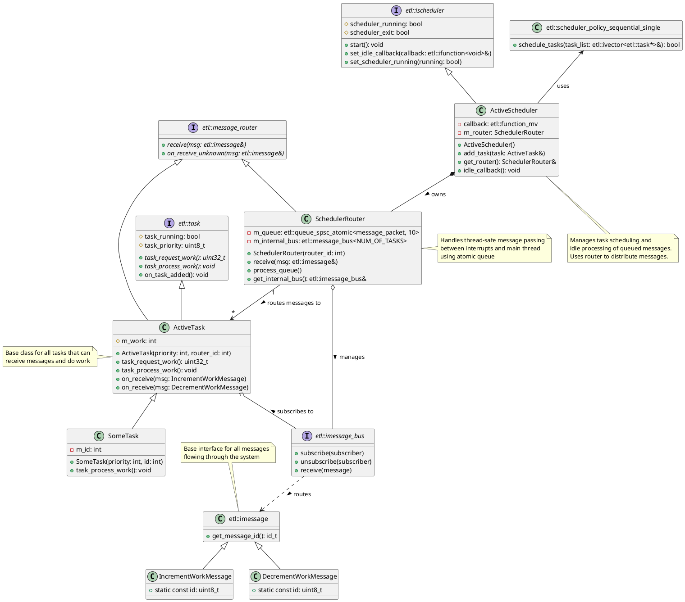

# ETL Investigations Class Diagram

This diagram shows the relationships between classes in the ETL Investigations project.

## Class Descriptions

### Core Components

- **SchedulerRouter**: Manages thread-safe message passing between interrupts and the main thread using an atomic queue
- **ActiveScheduler**: Coordinates task execution and manages message routing during idle time
- **ActiveTask**: Base class for tasks that can receive and process work messages
- **SomeTask**: Concrete task implementation with specific work processing behavior

### Message Infrastructure

- **etl::imessage**: Base interface for all messages in the system 
- **IncrementWorkMessage/DecrementWorkMessage**: Concrete message types for work control
- **etl::imessage_bus**: Message distribution system connecting routers to tasks
- **etl::queue_spsc_atomic**: Thread-safe queue for interrupt handling

### Key Relationships

1. Task Hierarchy:
   - Tasks inherit core functionality from `etl::task`
   - `ActiveTask` adds message handling capabilities
   - `SomeTask` provides concrete implementation

2. Message Flow:
   - Messages flow from interrupts through `SchedulerRouter`'s atomic queue
   - Router distributes messages via its internal message bus
   - Tasks receive messages through message bus subscription

3. Scheduler Integration:
   - `ActiveScheduler` coordinates task execution
   - Uses sequential single policy for task scheduling
   - Processes queued messages during idle time through router
