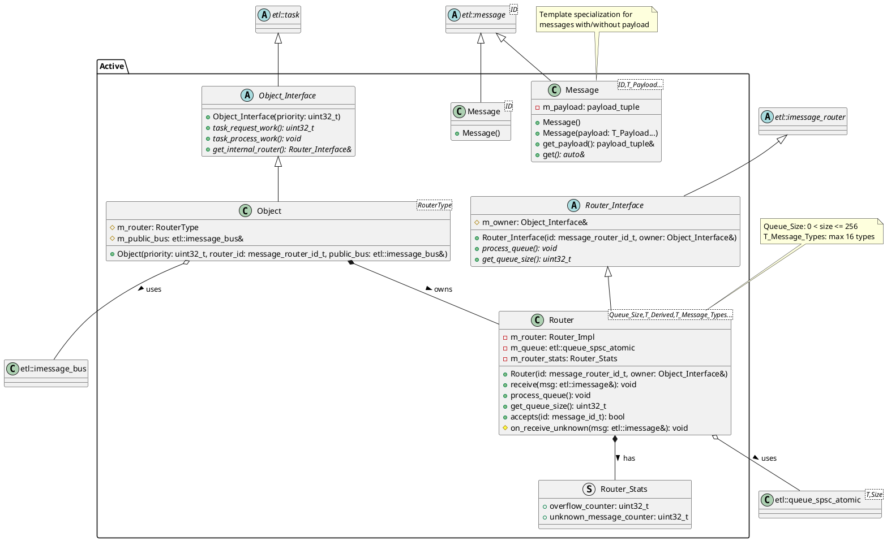

# Active Object Framework Class Diagram

## Key Components

1. **Object System**
   - `Object_Interface`: Base class for all active objects, inherits from ETL task system
   - `Object<RouterType>`: Template implementation that ties an active object to its router

2. **Router System**
   - `Router_Interface`: Base class for message routing, inherits from ETL message router
   - `Router<Queue_Size,T_Derived,T_Message_Types...>`: Template implementation with atomic message queue
   - `Router_Stats`: Statistics tracking for overflow and unknown messages

3. **Message System**
   - `Message<ID>`: Specialization for messages without payload
   - `Message<ID,T_Payload...>`: Specialization for messages with typed payload

## Design Features

- **Type Safety**: Template parameters ensure type-safe message handling
- **Memory Safety**: Fixed-size queues and compile-time size checks
- **Real-Time**: Lock-free queue implementation for ISR safety
- **Monitoring**: Built-in statistics for queue overflow and unknown messages
- **Flexibility**: Support for both payload and non-payload messages